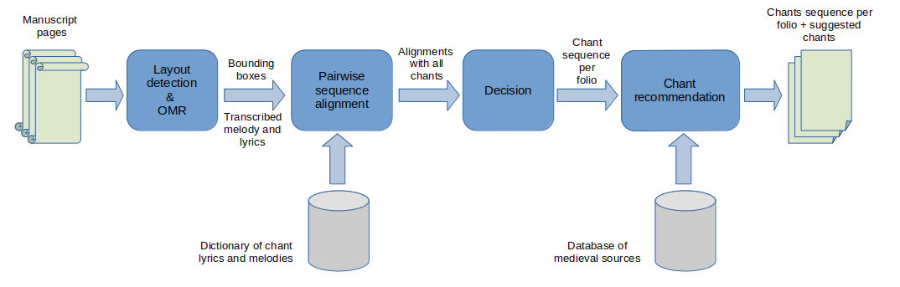

# Automatic Chant Detection (REPERTORIUM)

> **This code is part of REPERTORIUM project, funded by the European Union’s Horizon Europe programme under grant agreement No 101095065.**

This algorithm detects the sequence of chants present in images of music medieval manuscripts.

<p align="center">
</p>

## Requirements

Create a Python enviroment (anaconda/miniconda is recommended) containing the packages listed in `requirements.txt`.

## Usage

An out-of-the box example can be processed by running the script `gui.py`:

```bash
python3 -m gui.py
```

Select the option *123610* and click *Process* to analyze this example manuscript. An HTML page is open after completion, showing the sequence of chants found
on each folio (detailing their lyrics, notes, Cantus ID, position in the folio and probability).

You can also provide your own folder of manuscript images by selecting the option *Select folder*.
Just make sure the images are in `.png` format and named sequentially.


> **Note:** The OMR models are still in development.
